# VMS Enterprise: Relational Domain Model & ER Diagrams

This document contains the canonical relational data architecture for VMS Enterprise (PostgreSQL 16+). It models the full enterprise topology across 20 distinct domain groups (~105 normalized relational tables).

---

## 1. High-Level Relational Architecture

The architecture decouples reusable master entities (Tenants, Sites, Persons, External Organizations, Vehicles, Documents, Transport Activities) from domain transaction lifecycles (Visitor, Customer, Contractor, Service, Material), while feeding an append-only GHG accounting and physical access ledger.

```mermaid
graph TD
    subgraph MasterTopology [Master Enterprise Hierarchy]
        T[tenants] --> O[organizations]
        O --> S[sites]
        S --> G[gates]
        S --> Z[zones]
    end

    subgraph ReusableIdentities [Reusable Identity & Master Data]
        P[persons]
        EO[external_organizations]
        V[vehicles]
        D[documents]
    end

    subgraph OperationalDomains [Independent Operational Pipelines]
        VT[visitor_transactions]
        CT[customer_visit_transactions]
        CO[contractor_work_orders]
        SO[service_work_orders]
        MT[material_transactions]
    end

    subgraph PhysicalAccess [Physical Security & Gate Access]
        GT[gate_transactions]
        GE[gate_events (Immutable)]
    end

    subgraph TransportModel [Normalized Reusable Transport]
        TA[transport_activities]
    end

    subgraph ESGAndGHG [ESG & Carbon Accounting Engine]
        GA[ghg_activities]
        GC[ghg_calculations (Immutable)]
        EFV[emission_factor_versions (Immutable)]
    end

    P --> VT
    P --> CT
    P --> CO
    P --> SO
    P --> MT

    VT --> TA
    CT --> TA
    CO --> TA
    SO --> TA
    MT --> TA
    V --> TA

    TA --> GA
    GA --> GC
    EFV --> GC

    VT --> GT
    MT --> GT
    GT --> GE
```

---

## 2. Detailed Domain ER Diagrams (17 Diagrams)

### Diagram 1: Organizational Topology & Master Tenancy
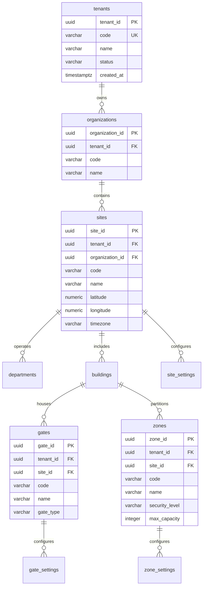
```mermaid
erDiagram
    tenants ||--o{ organizations : owns
    organizations ||--o{ sites : contains
    sites ||--o{ departments : operates
    sites ||--o{ buildings : includes
    buildings ||--o{ gates : houses
    buildings ||--o{ zones : partitions
    sites ||--o{ site_settings : configures
    gates ||--o{ gate_settings : configures
    zones ||--o{ zone_settings : configures

    tenants {
        uuid tenant_id PK
        varchar code UK
        varchar name
        varchar status
        timestamptz created_at
    }
    organizations {
        uuid organization_id PK
        uuid tenant_id FK
        varchar code
        varchar name
    }
    sites {
        uuid site_id PK
        uuid tenant_id FK
        uuid organization_id FK
        varchar code
        varchar name
        numeric latitude
        numeric longitude
        varchar timezone
    }
    gates {
        uuid gate_id PK
        uuid tenant_id FK
        uuid site_id FK
        varchar code
        varchar name
        varchar gate_type
    }
    zones {
        uuid zone_id PK
        uuid tenant_id FK
        uuid site_id FK
        varchar code
        varchar name
        varchar security_level
        integer max_capacity
    }
```

### Diagram 2: Identity & Access Control (RBAC/ABAC)
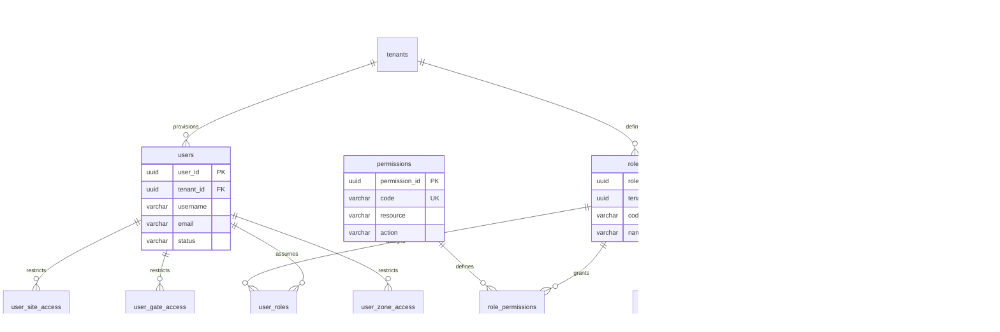
```mermaid
erDiagram
    tenants ||--o{ users : provisions
    tenants ||--o{ roles : defines
    roles ||--o{ role_permissions : grants
    permissions ||--o{ role_permissions : defines
    users ||--o{ user_roles : assumes
    roles ||--o{ user_roles : assigns
    users ||--o{ user_site_access : restricts
    users ||--o{ user_gate_access : restricts
    users ||--o{ user_zone_access : restricts
    roles ||--o{ zone_permissions : authorizes
    roles ||--o{ gate_permissions : authorizes
    access_policies ||--o{ access_policy_rules : enforces
    access_credentials ||--o{ access_grants : issues
    access_grants ||--o{ access_events : records

    users {
        uuid user_id PK
        uuid tenant_id FK
        varchar username
        varchar email
        varchar status
    }
    roles {
        uuid role_id PK
        uuid tenant_id FK
        varchar code
        varchar name
    }
    permissions {
        uuid permission_id PK
        varchar code UK
        varchar resource
        varchar action
    }
    access_policies {
        uuid policy_id PK
        uuid tenant_id FK
        varchar code
        varchar policy_type
    }
    access_credentials {
        uuid credential_id PK
        uuid tenant_id FK
        uuid person_id FK
        varchar identifier_token UK
        varchar credential_type
    }
```

### Diagram 3: Person & Reusable Identity Model
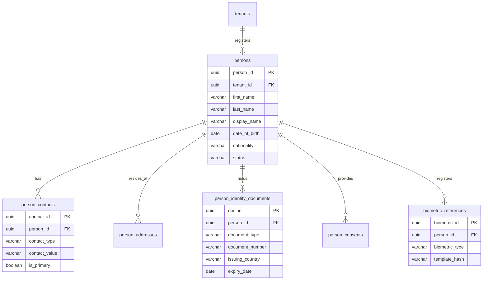
```mermaid
erDiagram
    tenants ||--o{ persons : registers
    persons ||--o{ person_contacts : has
    persons ||--o{ person_addresses : resides_at
    persons ||--o{ person_identity_documents : holds
    persons ||--o{ person_consents : provides
    persons ||--o{ biometric_references : registers

    persons {
        uuid person_id PK
        uuid tenant_id FK
        varchar first_name
        varchar last_name
        varchar display_name
        date date_of_birth
        varchar nationality
        varchar status
    }
    person_contacts {
        uuid contact_id PK
        uuid person_id FK
        varchar contact_type
        varchar contact_value
        boolean is_primary
    }
    person_identity_documents {
        uuid doc_id PK
        uuid person_id FK
        varchar document_type
        varchar document_number
        varchar issuing_country
        date expiry_date
    }
    biometric_references {
        uuid biometric_id PK
        uuid person_id FK
        varchar biometric_type
        varchar template_hash
    }
```

### Diagram 4: External Organizations Directory
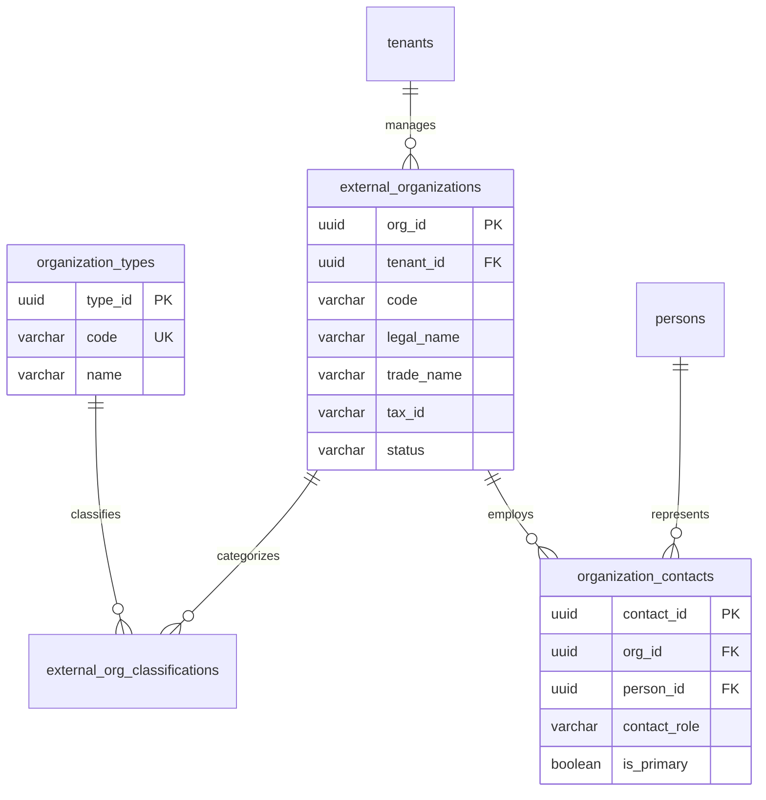
```mermaid
erDiagram
    tenants ||--o{ external_organizations : manages
    organization_types ||--o{ external_org_classifications : classifies
    external_organizations ||--o{ external_org_classifications : categorizes
    external_organizations ||--o{ organization_contacts : employs
    persons ||--o{ organization_contacts : represents

    external_organizations {
        uuid org_id PK
        uuid tenant_id FK
        varchar code
        varchar legal_name
        varchar trade_name
        varchar tax_id
        varchar status
    }
    organization_types {
        uuid type_id PK
        varchar code UK
        varchar name
    }
    organization_contacts {
        uuid contact_id PK
        uuid org_id FK
        uuid person_id FK
        varchar contact_role
        boolean is_primary
    }
```

### Diagram 5: Visitor Management Domain
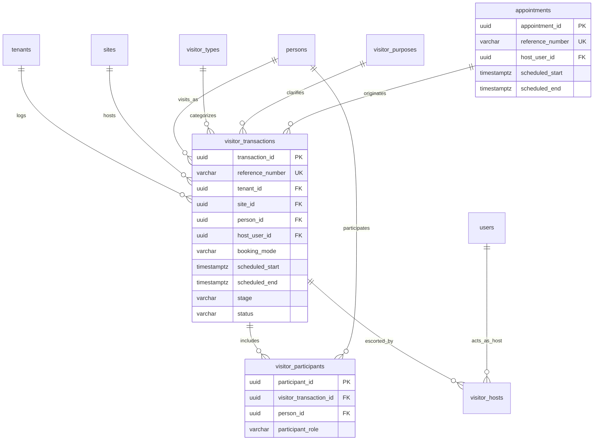
```mermaid
erDiagram
    tenants ||--o{ visitor_transactions : logs
    sites ||--o{ visitor_transactions : hosts
    persons ||--o{ visitor_transactions : visits_as
    visitor_types ||--o{ visitor_transactions : categorizes
    visitor_purposes ||--o{ visitor_transactions : clarifies
    appointments ||--o{ visitor_transactions : originates
    visitor_transactions ||--o{ visitor_participants : includes
    persons ||--o{ visitor_participants : participates
    visitor_transactions ||--o{ visitor_hosts : escorted_by
    users ||--o{ visitor_hosts : acts_as_host

    visitor_transactions {
        uuid transaction_id PK
        varchar reference_number UK
        uuid tenant_id FK
        uuid site_id FK
        uuid person_id FK
        uuid host_user_id FK
        varchar booking_mode
        timestamptz scheduled_start
        timestamptz scheduled_end
        varchar stage
        varchar status
    }
    appointments {
        uuid appointment_id PK
        varchar reference_number UK
        uuid host_user_id FK
        timestamptz scheduled_start
        timestamptz scheduled_end
    }
    visitor_participants {
        uuid participant_id PK
        uuid visitor_transaction_id FK
        uuid person_id FK
        varchar participant_role
    }
```

### Diagram 6: Customer Engagement Domain
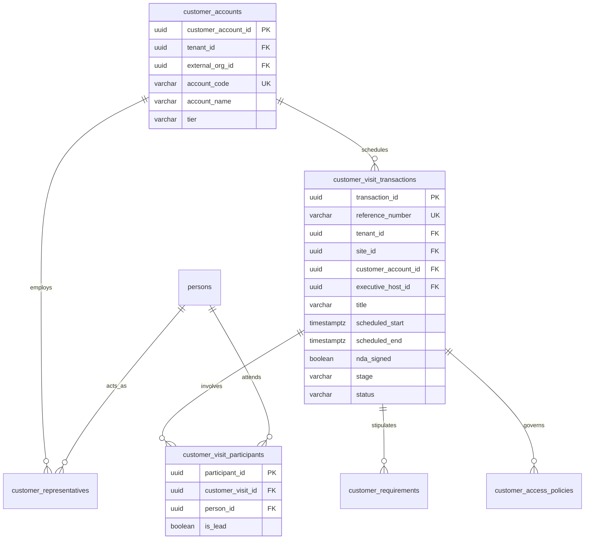
```mermaid
erDiagram
    customer_accounts ||--o{ customer_representatives : employs
    persons ||--o{ customer_representatives : acts_as
    customer_accounts ||--o{ customer_visit_transactions : schedules
    customer_visit_transactions ||--o{ customer_visit_participants : involves
    persons ||--o{ customer_visit_participants : attends
    customer_visit_transactions ||--o{ customer_requirements : stipulates
    customer_visit_transactions ||--o{ customer_access_policies : governs

    customer_accounts {
        uuid customer_account_id PK
        uuid tenant_id FK
        uuid external_org_id FK
        varchar account_code UK
        varchar account_name
        varchar tier
    }
    customer_visit_transactions {
        uuid transaction_id PK
        varchar reference_number UK
        uuid tenant_id FK
        uuid site_id FK
        uuid customer_account_id FK
        uuid executive_host_id FK
        varchar title
        timestamptz scheduled_start
        timestamptz scheduled_end
        boolean nda_signed
        varchar stage
        varchar status
    }
    customer_visit_participants {
        uuid participant_id PK
        uuid customer_visit_id FK
        uuid person_id FK
        boolean is_lead
    }
```

### Diagram 7: Contractor Management Domain
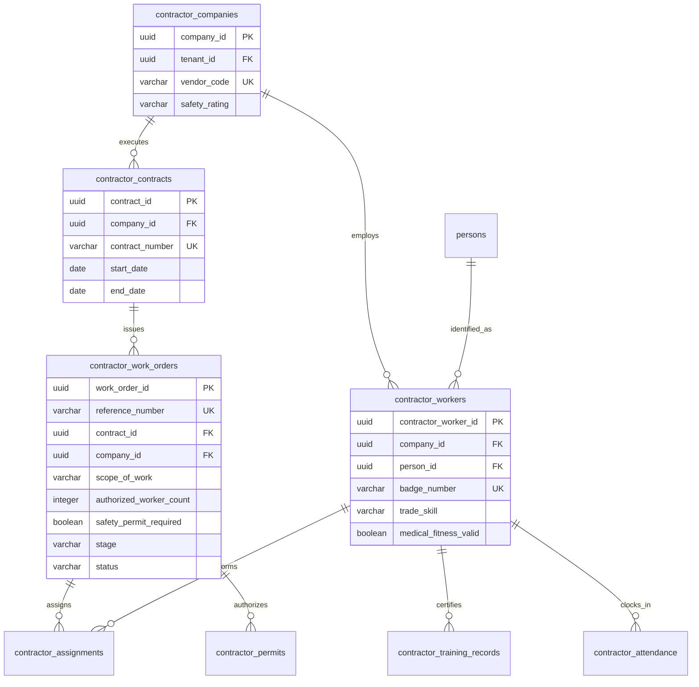
```mermaid
erDiagram
    contractor_companies ||--o{ contractor_contracts : executes
    contractor_contracts ||--o{ contractor_work_orders : issues
    contractor_companies ||--o{ contractor_workers : employs
    persons ||--o{ contractor_workers : identified_as
    contractor_work_orders ||--o{ contractor_assignments : assigns
    contractor_workers ||--o{ contractor_assignments : performs
    contractor_workers ||--o{ contractor_training_records : certifies
    contractor_work_orders ||--o{ contractor_permits : authorizes
    contractor_workers ||--o{ contractor_attendance : clocks_in

    contractor_companies {
        uuid company_id PK
        uuid tenant_id FK
        varchar vendor_code UK
        varchar safety_rating
    }
    contractor_contracts {
        uuid contract_id PK
        uuid company_id FK
        varchar contract_number UK
        date start_date
        date end_date
    }
    contractor_work_orders {
        uuid work_order_id PK
        varchar reference_number UK
        uuid contract_id FK
        uuid company_id FK
        varchar scope_of_work
        integer authorized_worker_count
        boolean safety_permit_required
        varchar stage
        varchar status
    }
    contractor_workers {
        uuid contractor_worker_id PK
        uuid company_id FK
        uuid person_id FK
        varchar badge_number UK
        varchar trade_skill
        boolean medical_fitness_valid
    }
```

### Diagram 8: Service Provider & Maintenance Domain
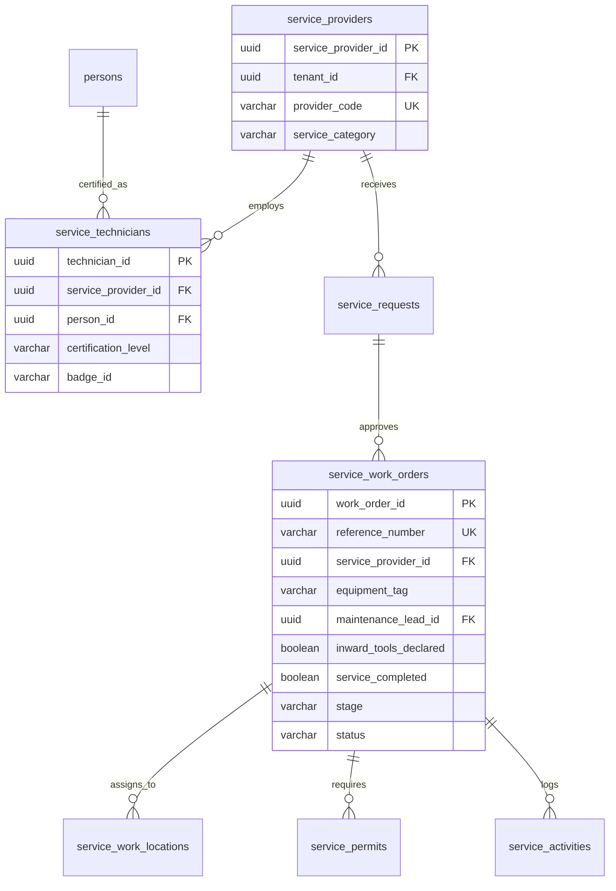
```mermaid
erDiagram
    service_providers ||--o{ service_technicians : employs
    persons ||--o{ service_technicians : certified_as
    service_providers ||--o{ service_requests : receives
    service_requests ||--o{ service_work_orders : approves
    service_work_orders ||--o{ service_work_locations : assigns_to
    service_work_orders ||--o{ service_permits : requires
    service_work_orders ||--o{ service_activities : logs

    service_providers {
        uuid service_provider_id PK
        uuid tenant_id FK
        varchar provider_code UK
        varchar service_category
    }
    service_technicians {
        uuid technician_id PK
        uuid service_provider_id FK
        uuid person_id FK
        varchar certification_level
        varchar badge_id
    }
    service_work_orders {
        uuid work_order_id PK
        varchar reference_number UK
        uuid service_provider_id FK
        varchar equipment_tag
        uuid maintenance_lead_id FK
        boolean inward_tools_declared
        boolean service_completed
        varchar stage
        varchar status
    }
```

### Diagram 9: Material Inward/Outward & Return Tracking
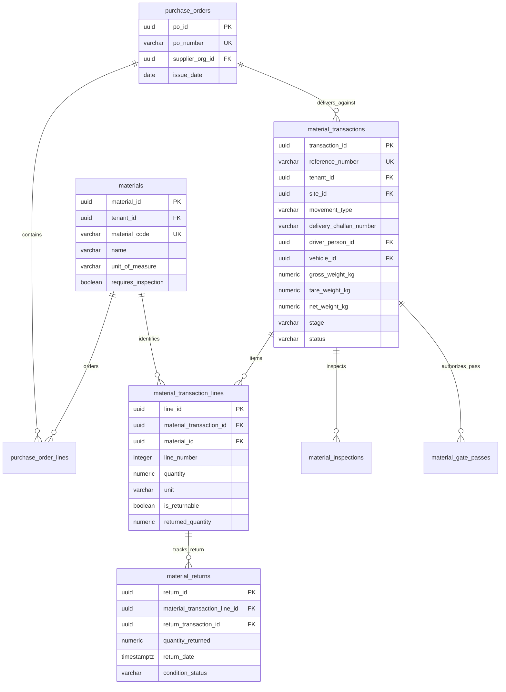
```mermaid
erDiagram
    materials ||--o{ purchase_order_lines : orders
    purchase_orders ||--o{ purchase_order_lines : contains
    purchase_orders ||--o{ material_transactions : delivers_against
    material_transactions ||--o{ material_transaction_lines : items
    materials ||--o{ material_transaction_lines : identifies
    material_transaction_lines ||--o{ material_returns : tracks_return
    material_transactions ||--o{ material_inspections : inspects
    material_transactions ||--o{ material_gate_passes : authorizes_pass

    materials {
        uuid material_id PK
        uuid tenant_id FK
        varchar material_code UK
        varchar name
        varchar unit_of_measure
        boolean requires_inspection
    }
    purchase_orders {
        uuid po_id PK
        varchar po_number UK
        uuid supplier_org_id FK
        date issue_date
    }
    material_transactions {
        uuid transaction_id PK
        varchar reference_number UK
        uuid tenant_id FK
        uuid site_id FK
        varchar movement_type
        varchar delivery_challan_number
        uuid driver_person_id FK
        uuid vehicle_id FK
        numeric gross_weight_kg
        numeric tare_weight_kg
        numeric net_weight_kg
        varchar stage
        varchar status
    }
    material_transaction_lines {
        uuid line_id PK
        uuid material_transaction_id FK
        uuid material_id FK
        integer line_number
        numeric quantity
        varchar unit
        boolean is_returnable
        numeric returned_quantity
    }
    material_returns {
        uuid return_id PK
        uuid material_transaction_line_id FK
        uuid return_transaction_id FK
        numeric quantity_returned
        timestamptz return_date
        varchar condition_status
    }
```

### Diagram 10: Vehicle & Driver Fleet Management
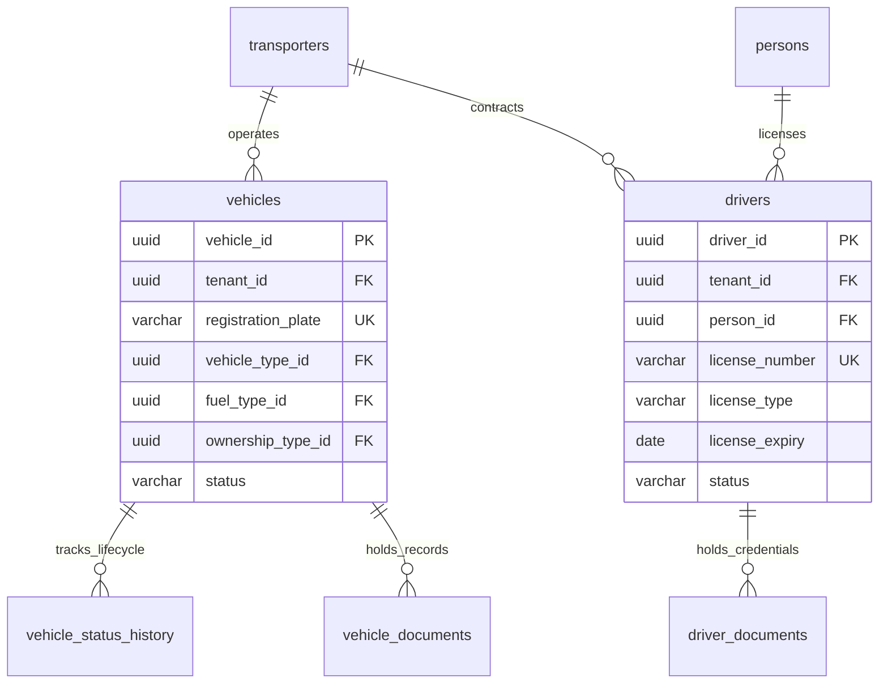
```mermaid
erDiagram
    transporters ||--o{ vehicles : operates
    transporters ||--o{ drivers : contracts
    persons ||--o{ drivers : licenses
    vehicles ||--o{ vehicle_status_history : tracks_lifecycle
    vehicles ||--o{ vehicle_documents : holds_records
    drivers ||--o{ driver_documents : holds_credentials

    vehicles {
        uuid vehicle_id PK
        uuid tenant_id FK
        varchar registration_plate UK
        uuid vehicle_type_id FK
        uuid fuel_type_id FK
        uuid ownership_type_id FK
        varchar status
    }
    drivers {
        uuid driver_id PK
        uuid tenant_id FK
        uuid person_id FK
        varchar license_number UK
        varchar license_type
        date license_expiry
        varchar status
    }
```

### Diagram 11: Reusable Normalized Transport Activity Model
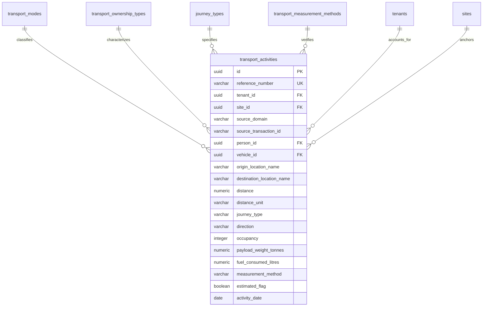
```mermaid
erDiagram
    transport_modes ||--o{ transport_activities : classifies
    transport_ownership_types ||--o{ transport_activities : characterizes
    journey_types ||--o{ transport_activities : specifies
    transport_measurement_methods ||--o{ transport_activities : verifies
    tenants ||--o{ transport_activities : accounts_for
    sites ||--o{ transport_activities : anchors

    transport_activities {
        uuid id PK
        varchar reference_number UK
        uuid tenant_id FK
        uuid site_id FK
        varchar source_domain
        varchar source_transaction_id
        uuid person_id FK
        uuid vehicle_id FK
        varchar origin_location_name
        varchar destination_location_name
        numeric distance
        varchar distance_unit
        varchar journey_type
        varchar direction
        integer occupancy
        numeric payload_weight_tonnes
        numeric fuel_consumed_litres
        varchar measurement_method
        boolean estimated_flag
        date activity_date
    }
```

### Diagram 12: Centralized Document Vault & Poly-Links
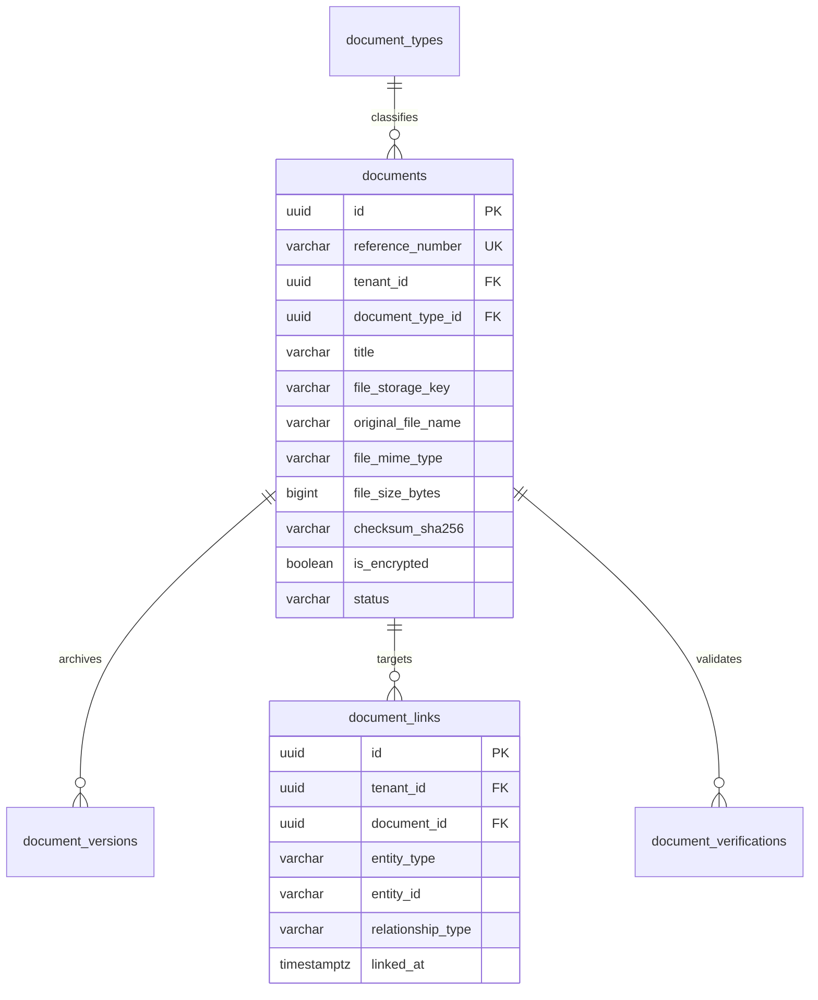
```mermaid
erDiagram
    document_types ||--o{ documents : classifies
    documents ||--o{ document_versions : archives
    documents ||--o{ document_links : targets
    documents ||--o{ document_verifications : validates

    documents {
        uuid id PK
        varchar reference_number UK
        uuid tenant_id FK
        uuid document_type_id FK
        varchar title
        varchar file_storage_key
        varchar original_file_name
        varchar file_mime_type
        bigint file_size_bytes
        varchar checksum_sha256
        boolean is_encrypted
        varchar status
    }
    document_links {
        uuid id PK
        uuid tenant_id FK
        uuid document_id FK
        varchar entity_type
        varchar entity_id
        varchar relationship_type
        timestamptz linked_at
    }
```

### Diagram 13: Safety, Inductions & Emergency Evacuation
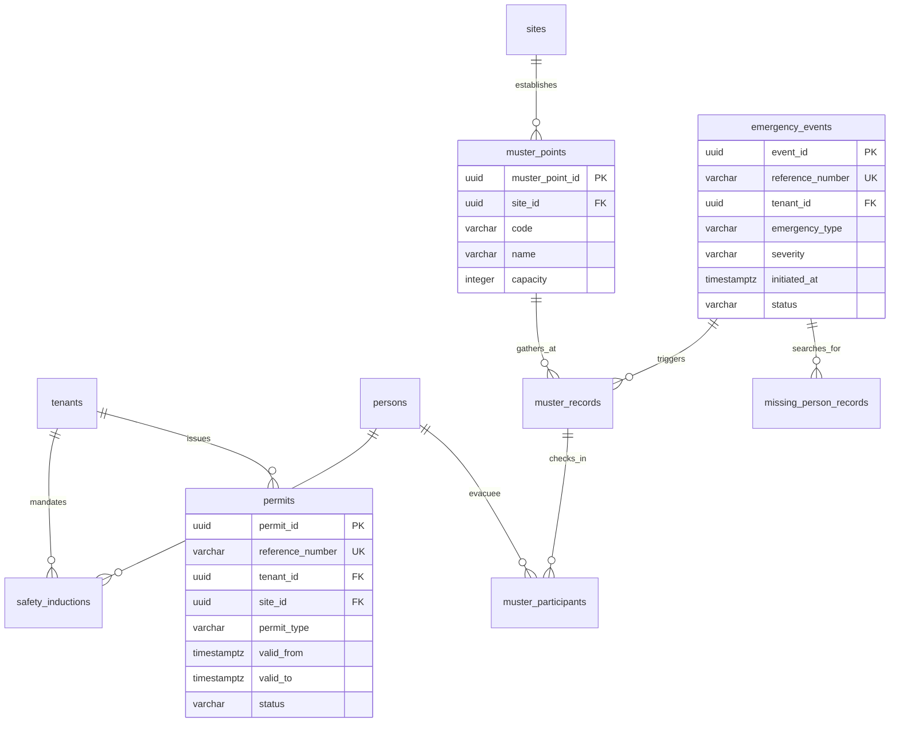
```mermaid
erDiagram
    tenants ||--o{ safety_inductions : mandates
    persons ||--o{ safety_inductions : undergoes
    tenants ||--o{ permits : issues
    sites ||--o{ muster_points : establishes
    emergency_events ||--o{ muster_records : triggers
    muster_points ||--o{ muster_records : gathers_at
    muster_records ||--o{ muster_participants : checks_in
    persons ||--o{ muster_participants : evacuee
    emergency_events ||--o{ missing_person_records : searches_for

    permits {
        uuid permit_id PK
        varchar reference_number UK
        uuid tenant_id FK
        uuid site_id FK
        varchar permit_type
        timestamptz valid_from
        timestamptz valid_to
        varchar status
    }
    emergency_events {
        uuid event_id PK
        varchar reference_number UK
        uuid tenant_id FK
        varchar emergency_type
        varchar severity
        timestamptz initiated_at
        varchar status
    }
    muster_points {
        uuid muster_point_id PK
        uuid site_id FK
        varchar code
        varchar name
        integer capacity
    }
```

### Diagram 14: Physical Gate Execution & Hardware Ledgers
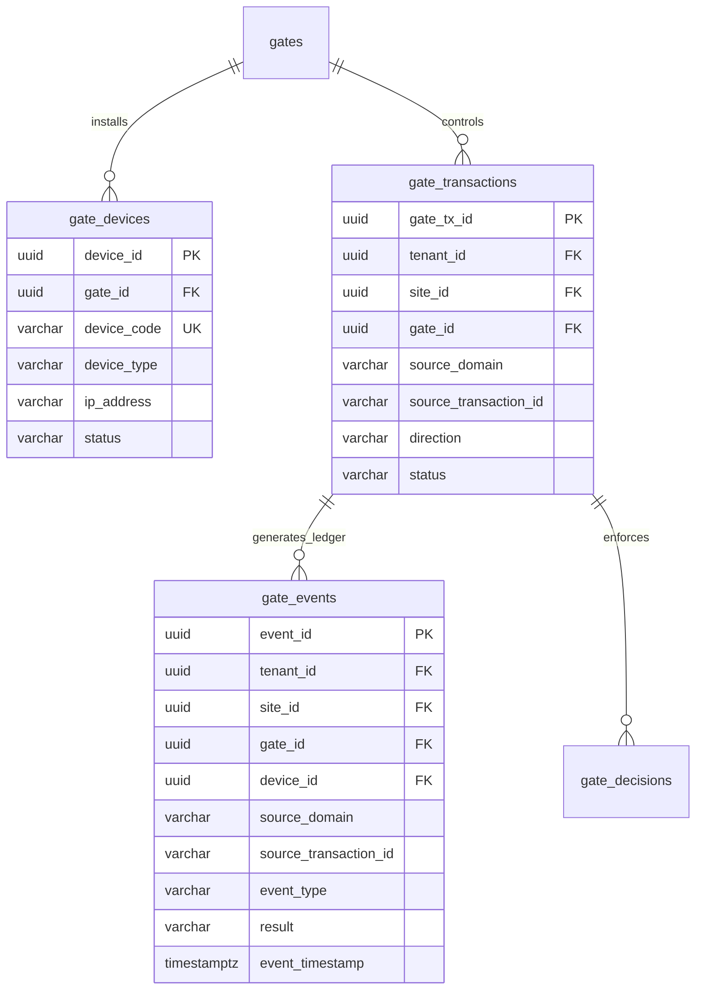
```mermaid
erDiagram
    gates ||--o{ gate_devices : installs
    gates ||--o{ gate_transactions : controls
    gate_transactions ||--o{ gate_events : generates_ledger
    gate_transactions ||--o{ gate_decisions : enforces

    gate_devices {
        uuid device_id PK
        uuid gate_id FK
        varchar device_code UK
        varchar device_type
        varchar ip_address
        varchar status
    }
    gate_transactions {
        uuid gate_tx_id PK
        uuid tenant_id FK
        uuid site_id FK
        uuid gate_id FK
        varchar source_domain
        varchar source_transaction_id
        varchar direction
        varchar status
    }
    gate_events {
        uuid event_id PK
        uuid tenant_id FK
        uuid site_id FK
        uuid gate_id FK
        uuid device_id FK
        varchar source_domain
        varchar source_transaction_id
        varchar event_type
        varchar result
        timestamptz event_timestamp
    }
```

### Diagram 15: ESG Activity Capture & GHG Provenance Ledger
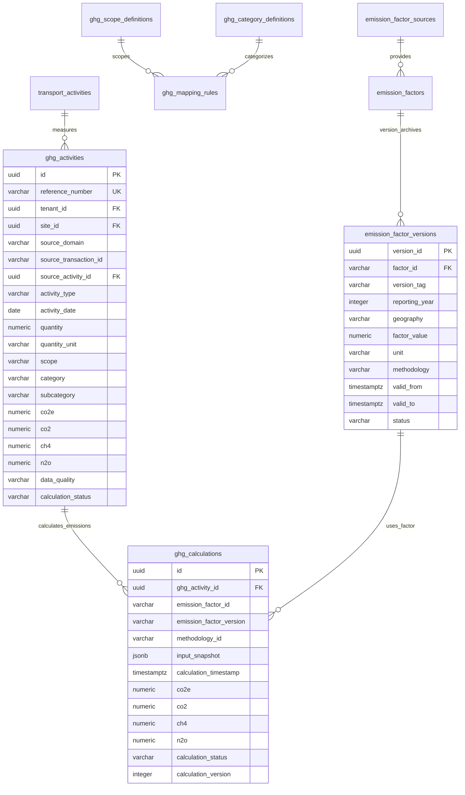
```mermaid
erDiagram
    emission_factor_sources ||--o{ emission_factors : provides
    emission_factors ||--o{ emission_factor_versions : version_archives
    ghg_scope_definitions ||--o{ ghg_mapping_rules : scopes
    ghg_category_definitions ||--o{ ghg_mapping_rules : categorizes
    transport_activities ||--o{ ghg_activities : measures
    ghg_activities ||--o{ ghg_calculations : calculates_emissions
    emission_factor_versions ||--o{ ghg_calculations : uses_factor

    ghg_activities {
        uuid id PK
        varchar reference_number UK
        uuid tenant_id FK
        uuid site_id FK
        varchar source_domain
        varchar source_transaction_id
        uuid source_activity_id FK
        varchar activity_type
        date activity_date
        numeric quantity
        varchar quantity_unit
        varchar scope
        varchar category
        varchar subcategory
        numeric co2e
        numeric co2
        numeric ch4
        numeric n2o
        varchar data_quality
        varchar calculation_status
    }
    ghg_calculations {
        uuid id PK
        uuid ghg_activity_id FK
        varchar emission_factor_id
        varchar emission_factor_version
        varchar methodology_id
        jsonb input_snapshot
        timestamptz calculation_timestamp
        numeric co2e
        numeric co2
        numeric ch4
        numeric n2o
        varchar calculation_status
        integer calculation_version
    }
    emission_factor_versions {
        uuid version_id PK
        varchar factor_id FK
        varchar version_tag
        integer reporting_year
        varchar geography
        numeric factor_value
        varchar unit
        varchar methodology
        timestamptz valid_from
        timestamptz valid_to
        varchar status
    }
```
